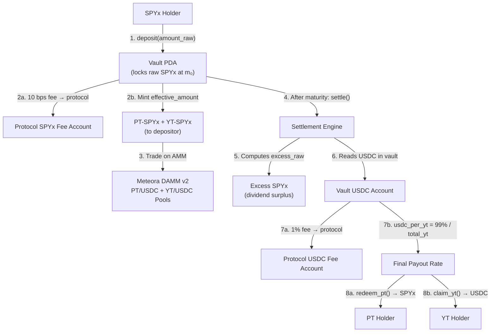

# StockSplit

> Yield-stripping protocol for tokenized equities on Solana. Decompose any Token-2022 stock into a discounted Principal Token and a pure dividend Yield Token, tradeable on live Meteora AMM pools.

**Live Application**: [https://stocksplit-app.vercel.app](https://stocksplit-app.vercel.app)  
**Split SPYx**: [https://stocksplit-app.vercel.app/split](https://stocksplit-app.vercel.app/split)  
**Trade PT & YT**: [https://stocksplit-app.vercel.app/trade](https://stocksplit-app.vercel.app/trade)  
**Redeem Positions**: [https://stocksplit-app.vercel.app/redeem](https://stocksplit-app.vercel.app/redeem)  
**Technical Documentation**: [https://stocksplit-app.vercel.app/docs](https://stocksplit-app.vercel.app/docs)

StockSplit takes a tokenized S&P 500 stock (SPYx) that accrues dividends through Token-2022's `ScaledUiAmountConfig` multiplier and splits it into two independent, tradeable instruments: a **Principal Token (PT)** representing discounted capital exposure, and a **Yield Token (YT)** representing the pure dividend cash flow settled in USDC. The protocol enforces the yield-stripping invariant `P_Stock = P_PT + P_YT` at all times, verified on-chain and across two live Meteora DAMM v2 liquidity pools.

---

## Overview

Tokenized stocks on Solana accrue dividends not by distributing USDC to holders, but by expanding the Token-2022 `ScaledUiAmountConfig` multiplier over time. When SPYx's multiplier moves from 1.000 to 1.013, holders receive 1.3% more ui-amount for the same raw token balance. StockSplit captures this mechanic and decomposes it into distinct tradeable instruments:

1. **Vault-Based Yield Stripping**: Any SPYx holder deposits their tokens into an Anchor smart vault that snapshots the multiplier at entry (`m₀`). The vault mints equal amounts of PT and YT to the depositor, each redeemable for a different economic claim at maturity.
2. **Principal Token (PT)**: A zero-coupon bond on the underlying stock. PT holders receive the original stock at maturity using the ratio `m₀ / m₁`, which strips out the dividend growth. Buy SPYx at ~$533 instead of $540 by forgoing the yield.
3. **Yield Token (YT)**: A pure dividend claim. At maturity, the vault computes the excess raw tokens created by multiplier expansion, converts them to USDC, and distributes the proceeds pro-rata to YT holders.
4. **Live AMM Trading**: PT and YT trade on two Meteora DAMM v2 constant-product pools on devnet. The PT pool prices at ~$533.62 and the YT pool at ~$7.11, confirming the invariant: $533.62 + $7.11 = $540.73 ≈ $540.00 (SPYx spot).
5. **Dual Pyth Hermes Feeds**: The frontend consumes both `Equity.US.VOO/USD` (TradFi reference) and `Crypto.SPYX/USD` (on-chain token) price feeds from Pyth Hermes. The spread between them represents the dividend premium embedded in the token price, and drives the pricing calibration across the protocol.
6. **Protocol Fee System**: Two on-chain fees enforce protocol economics. A 10 basis point split fee is deducted from SPYx on deposit before minting PT/YT, and a 100 basis point clearinghouse fee is deducted from USDC proceeds at settlement before computing the final `usdc_per_yt` payout rate.
7. **Full Lifecycle Frontend**: Next.js 14 application covering every step of the protocol: faucet, deposit/split, live AMM trading, vault settlement, PT redemption, YT claiming, and early withdrawal. Includes a pre-settled demo vault so judges can test redemption and claiming without waiting for maturity.

---

## Why Token-2022 Makes This Possible

The entire protocol depends on a Solana-native primitive that does not exist on any other chain. Token-2022's `ScaledUiAmountConfig` extension allows a mint authority to increase the display multiplier over time, meaning the same raw token balance represents progressively more value as dividends accrue.

StockSplit exploits this directly in the vault math:

```
excess_raw = total_deposited × (1 - m₀ / m₁)
```

When the multiplier expands from `m₀ = 1.000` to `m₁ = 1.013`, the vault holds more raw tokens than PT holders are owed. That surplus is the dividend, and it gets liquidated into USDC for YT holders. Without Token-2022's multiplier expansion, this yield-stripping mechanism cannot be implemented.

This is the same financial model as [Pendle Finance](https://pendle.finance/) ($1B+ TVL on Ethereum), adapted for tokenized equities using Solana-native infrastructure.

---

## Settlement Architecture

Settlement is permissionless and caller-executed. After maturity, anyone can trigger `settle()` to finalize the vault:



The settler receives excess SPYx from the vault and is responsible for converting it to USDC (via Jupiter or any DEX) and depositing the proceeds into the vault's USDC escrow account before or atomically with the settle call. In production, this would be bundled via Jito. On devnet, USDC is pre-funded by the protocol authority for demonstration.

---

## Financial Mathematics

For a baseline SPYx price of $540.00 with a 1.30% annualized dividend yield (multiplier expansion from 1.000 to 1.013 over one year):

```
PT price  = $540.00 / 1.013  = $533.07   (zero-coupon bond, no dividend risk)
YT price  = $540.00 - $533.07 = $6.93    (pure dividend exposure at a fraction of stock price)
```

**Worked example with 18.5 SPYx deposit (18,500,000 raw units at 6 decimals):**

| Step | Calculation | Result |
|------|-------------|--------|
| Protocol fee (10 bps) | 18,500,000 × 10 / 10,000 | 18,500 raw SPYx to protocol |
| Effective deposit | 18,500,000 - 18,500 | 18,481,500 raw (PT + YT minted) |
| PT claim at maturity | floor(18,481,500 × 1.000 / 1.013) | 18,243,311 raw SPYx returned |
| Excess (dividend) | 18,481,500 - 18,243,311 | 238,189 raw SPYx |
| USDC proceeds (simulated) | 238,189 raw SPYx → Jupiter swap | ~$130.00 USDC |
| Clearinghouse fee (1%) | $130.00 × 1% | $1.30 USDC to protocol |
| Distributable USDC | $130.00 - $1.30 | $128.70 USDC to YT holders |
| Conservation check | 18,243,311 (PT) + 238,189 (YT) | 18,481,500 = effective deposit ✓ |

**Live pool verification:** PT trades at ~$533.62, YT trades at ~$7.11. Sum = $540.73 ≈ $540.00 spot. The invariant holds.

---

## The 7 On-Chain Instructions

The Anchor program is deployed on Solana Devnet under Program ID `9WRT68i9TJ1wi3fDv4offsxbNmkkstQAHY9XNN4YQnZG`. All 7 instructions are tested and operational.

| # | Instruction | Purpose | Key Mechanics |
|---|-------------|---------|---------------|
| 1 | `initialize_vault` | Create a new vault for a given stock and maturity | Deploys PT + YT SPL mints, creates xStock + USDC escrow accounts, snapshots multiplier m₀ |
| 2 | `deposit` | Lock SPYx and receive PT + YT | Deducts 10 bps fee via Token-2022 CPI, transfers effective amount to vault, mints equal PT + YT |
| 3 | `update_multiplier` | Authority-controlled oracle update | Sets current multiplier m₁ in vault state (production: read directly from Token-2022 TLV data) |
| 4 | `settle` | Finalize vault after maturity | Transfers excess SPYx to caller, deducts 1% USDC fee, computes `usdc_per_yt` from remaining 99% |
| 5 | `redeem_pt` | Burn PT and receive SPYx | Returns `amount × (m₀ / m₁)` raw SPYx to redeemer, decrements `total_pt_outstanding` |
| 6 | `claim_yt` | Burn YT and receive USDC | Sends `amount × usdc_per_yt` USDC to claimer, decrements `total_yt_outstanding` |
| 7 | `withdraw` | Early exit before maturity | Burns equal PT + YT, returns raw SPYx 1:1, only callable while vault is unsettled |

---

## Protocol Fee Accounts and Validation

Both protocol fees are enforced on-chain with manual account validation. The program parses raw byte layouts of Token-2022 and SPL token accounts to verify that fee destinations match the expected mint and are owned by `vault.authority`:

| Fee | Rate | Trigger | On-Chain Math | Collector |
|-----|------|---------|---------------|-----------|
| Split fee | 10 bps (0.10%) | On every `deposit` call | `fee_raw = amount_raw × 10 / 10_000` | `PROTOCOL_SPYX_FEE_ACCOUNT` (Token-2022) |
| Clearinghouse fee | 100 bps (1.0%) | On every `settle` call | `fee_usdc = total_usdc × 100 / 10_000` | `PROTOCOL_USDC_FEE_ACCOUNT` (SPL Token) |

Fee account validation reads bytes `[0..32]` (mint) and `[32..64]` (owner) directly from the account data to avoid extension parsing overhead while maintaining security.

---

## Pyth Hermes Integration

The protocol consumes two live Pyth Hermes price feeds, polled every 30 seconds via a Next.js API route:

| Feed | Pyth ID | Purpose |
|------|---------|---------|
| `Equity.US.VOO/USD` | `0x236b30dd...f179` | Vanguard S&P 500 ETF - same index as SPY, available on Pyth Pro trial |
| `Crypto.SPYX/USD` | `0x19e09bb...12684` | On-chain tokenized stock price |

The spread between these two feeds represents the dividend premium embedded in the tokenized stock price. Pyth data drives the hero pricing display, the PT/YT theoretical pricing calculations on the split form, the implied discount and yield APY on the trade page, and the market hours detection (the hero shows an open/closed indicator based on Pyth's `market_hours.is_open` field).

---

## Meteora AMM Pools

PT and YT trade on two live Meteora DAMM v2 constant-product pools on Solana Devnet. Swaps are executed on-chain via the `@meteora-ag/dynamic-amm-sdk`, with AMM quotes computed client-side using `x × y = k` math and a 100 bps trading fee.

| Pool | Address | Reserves | Spot Price |
|------|---------|----------|------------|
| PT-SPYx / USDC | [`8cwZ7yES...oW7s`](https://explorer.solana.com/address/8cwZ7yESFJw7DyM1JWVE92Zu9NHHX82jbdCau6v1oW7s?cluster=devnet) | 112.3 PT / $59,920 USDC (~$120K TVL) | ~$533.62 |
| YT-SPYx / USDC | [`BvMKwwPF...ax6o`](https://explorer.solana.com/address/BvMKwwPFH781QqJuk4pRdvATg2rSuyHzVLuGMpgrax6o?cluster=devnet) | 176.3 YT / $1,254 USDC (~$2.5K TVL) | ~$7.11 |

The trade page shows live pool reserves, computed output amounts, price impact (color-coded by severity), implied discount (PT) and implied yield APY (YT), with a 2.5% internal slippage buffer for reliable devnet execution.

---

## Devnet Addresses

Network: **Solana Devnet**  
RPC: `https://api.devnet.solana.com`

| Asset | Address | Type |
|-------|---------|------|
| **StockSplit Program** | [`9WRT68i9TJ1wi3fDv4offsxbNmkkstQAHY9XNN4YQnZG`](https://explorer.solana.com/address/9WRT68i9TJ1wi3fDv4offsxbNmkkstQAHY9XNN4YQnZG?cluster=devnet) | Anchor Program |
| **Demo Vault PDA** | [`96ThTiiMHJLtQE9BfukzYUiHCNByptfkF6s1oiBbHYsR`](https://explorer.solana.com/address/96ThTiiMHJLtQE9BfukzYUiHCNByptfkF6s1oiBbHYsR?cluster=devnet) | Pre-settled vault for testing |
| **SPYx Mint** | [`EMqGxJdEaCEPxN5NhKY4sAoze877TRhfhVrXYLbg5GC8`](https://explorer.solana.com/address/EMqGxJdEaCEPxN5NhKY4sAoze877TRhfhVrXYLbg5GC8?cluster=devnet) | Token-2022 (ScaledUiAmount) |
| **PT-SPYx Mint** | [`3GSyLYWRSZaNdPW41xcTrWrR7Qvn6X5Lv4F3d4CUHni3`](https://explorer.solana.com/address/3GSyLYWRSZaNdPW41xcTrWrR7Qvn6X5Lv4F3d4CUHni3?cluster=devnet) | Standard SPL Token |
| **YT-SPYx Mint** | [`HhKNM1MTQU1dG4jyyHnuT6cz4GSyeakR2yN8GGmBb4WE`](https://explorer.solana.com/address/HhKNM1MTQU1dG4jyyHnuT6cz4GSyeakR2yN8GGmBb4WE?cluster=devnet) | Standard SPL Token |
| **USDC Mint** | [`AXQKoNyChJ9vihK3qThe9UdT6xteoh1Lc4roqP98i2zW`](https://explorer.solana.com/address/AXQKoNyChJ9vihK3qThe9UdT6xteoh1Lc4roqP98i2zW?cluster=devnet) | Standard SPL Token |
| **PT DAMM v2 Pool** | [`8cwZ7yESFJw7DyM1JWVE92Zu9NHHX82jbdCau6v1oW7s`](https://explorer.solana.com/address/8cwZ7yESFJw7DyM1JWVE92Zu9NHHX82jbdCau6v1oW7s?cluster=devnet) | Meteora DAMM v2 |
| **YT DAMM v2 Pool** | [`BvMKwwPFH781QqJuk4pRdvATg2rSuyHzVLuGMpgrax6o`](https://explorer.solana.com/address/BvMKwwPFH781QqJuk4pRdvATg2rSuyHzVLuGMpgrax6o?cluster=devnet) | Meteora DAMM v2 |
| **YT DBC Pool** | [`FmPChn3VTSainyKArE7zFLn3FMxKnRwTxdLrgmyfVHg5`](https://explorer.solana.com/address/FmPChn3VTSainyKArE7zFLn3FMxKnRwTxdLrgmyfVHg5?cluster=devnet) | Meteora DBC (reference) |
| **SPYx Fee Collector** | [`6qPBcP5wrj5VRntR8TswdbV3x5FHMrCmWFNwqZnq1Tgn`](https://explorer.solana.com/address/6qPBcP5wrj5VRntR8TswdbV3x5FHMrCmWFNwqZnq1Tgn?cluster=devnet) | Token-2022 (10 bps deposit fee) |
| **USDC Fee Collector** | [`4PDpCWzeo2ruaT3WYAaL2A22PUFYiFSEskCJ12yyefTi`](https://explorer.solana.com/address/4PDpCWzeo2ruaT3WYAaL2A22PUFYiFSEskCJ12yyefTi?cluster=devnet) | SPL Token (1% settle fee) |
| **Vault Authority** | [`8ieVC6ufupkxqCgAEoUEReYWkWZwLZQHK3u9RYZy8Ps6`](https://explorer.solana.com/address/8ieVC6ufupkxqCgAEoUEReYWkWZwLZQHK3u9RYZy8Ps6?cluster=devnet) | Fee account owner |

---

## Testing the Demo

The fastest way to verify the full lifecycle without waiting for vault maturity:

1. Visit the app and connect any Solana wallet set to Devnet
2. Click **Get 50 test SPYx** on the faucet banner (also sends devnet SOL for gas)
3. On the Split page, enter 10 SPYx, select **1 Min (DEV)** maturity, and observe the 10 bps fee preview before confirming
4. After the 2-minute countdown expires on the Redeem page, click **Settle Vault** to finalize
5. Click **Redeem PT** to receive SPYx back, and **Claim YT** to receive USDC

Alternatively, click **Get demo position** on the Redeem page to receive 18.5 PT + 18.5 YT from the pre-settled demo vault, then redeem and claim immediately without any wait.

---

## Verification and Test Results

Full test suite covering all 7 instructions, off-chain math verification, protocol fee accounting, and error boundary testing. Run with:

```bash
npx ts-mocha --require ts-node/register/transpile-only -p tsconfig.json -t 1000000 tests/stocksplit.ts
```

| Section | Test | Status |
|---------|------|--------|
| **1. initialize_vault** | Creates vault with correct initial state | ✓ |
| | Rejects maturity in the past | ✓ |
| **2. update_multiplier** | Allows authority to update multiplier | ✓ |
| | Rejects non-authority caller | ✓ |
| **3. deposit** | Mints equal PT and YT on deposit | ✓ |
| | Rejects zero-amount deposit | ✓ |
| **4. settle** | Waits for maturity, updates multiplier, then settles | ✓ |
| | Rejects double settle | ✓ |
| **5. redeem_pt** | Burns PT and returns xStock at the correct ratio | ✓ |
| **6. claim_yt** | Burns YT and distributes USDC pro-rata | ✓ |
| **7. off-chain math** | Verifies settlement math: multiplier_ratio | ✓ |
| | Verifies usdc_per_yt math | ✓ |
| | Verifies full round-trip: deposit=18.5 SPYx, yield=$130 USDC | ✓ |
| **8. withdraw** | Withdraws SPYx before maturity and updates accounting | ✓ |
| | Rejects withdraw after settlement | ✓ |
| **9. protocol fees** | Deposit 18.5M SPYx: user gets 18,481,500 PT/YT, protocol gets 18,500 SPYx | ✓ |
| | Settle: protocol gets 1% USDC fee, usdc_per_yt uses 99% | ✓ |
| | Invalid fee account: deposit rejects wrong owner | ✓ |

**18 passing, 0 failing** across 9 test sections.

---

## Local Setup

### Frontend
```bash
cd app
cp .env.example .env.local    # configure RPC_URL if needed
npm install
npm run dev
# → http://localhost:3000
```

### Smart Contract Build
```bash
# Requires solana-cli + Anchor toolchain
cargo build-sbf --manifest-path programs/stocksplit/Cargo.toml
```

### Tests
```bash
# Set environment for devnet testing
export ANCHOR_PROVIDER_URL=https://api.devnet.solana.com
export ANCHOR_WALLET=~/.config/solana/id.json

npx ts-mocha --require ts-node/register/transpile-only -p tsconfig.json -t 1000000 tests/stocksplit.ts
```

---

## Repository Structure

```
solana/
├── programs/stocksplit/src/
│   ├── lib.rs                      Program entry, 7 instruction dispatchers
│   ├── state.rs                    Vault account struct (17 fields, f64-in-u64 multiplier storage)
│   ├── errors.rs                   17 typed error codes
│   ├── utils.rs                    Shared helpers
│   └── instructions/
│       ├── initialize_vault.rs     Vault PDA creation, PT/YT mint deployment
│       ├── deposit.rs              Token-2022 CPI transfer, 10 bps fee, PT/YT mint
│       ├── update_multiplier.rs    Authority-gated oracle update
│       ├── settle.rs               Post-maturity settlement, 1% clearinghouse fee
│       ├── redeem_pt.rs            PT burn, SPYx return at m₀/m₁ ratio
│       ├── claim_yt.rs             YT burn, pro-rata USDC payout
│       └── withdraw.rs             Early exit: burn PT+YT, reclaim SPYx
├── tests/
│   └── stocksplit.ts               18 tests across 9 sections
├── target/
│   ├── idl/stocksplit.json         Anchor IDL (synced to frontend)
│   └── types/stocksplit.ts         Generated TypeScript types
├── scripts/
│   └── create-fee-accounts.ts      One-time devnet fee account creation
├── addresses.json                  All deployed devnet addresses
├── app/                            Next.js 14 frontend
│   └── src/
│       ├── app/
│       │   ├── page.tsx            Landing page (hero, live pricing, protocol explainer)
│       │   ├── split/page.tsx      Split form with fee preview, maturity selector, withdraw
│       │   ├── trade/page.tsx      Dual AMM swap panels (PT/USDC + YT/USDC)
│       │   ├── redeem/page.tsx     Demo vault, user positions, redemption/claiming
│       │   ├── docs/page.tsx       Technical docs with invariant proofs and addresses
│       │   └── api/
│       │       ├── faucet/         Mints 50 SPYx + airdrops devnet SOL
│       │       ├── airdrop-position/ Sends 18.5 PT + 18.5 YT from demo vault
│       │       ├── price/          Pyth Hermes feed aggregator
│       │       └── balances/       Token balance resolver
│       ├── components/
│       │   ├── hero.tsx            Live Pyth prices, multiplier display
│       │   ├── split-form.tsx      Split UI with fee breakdown, multi-stage tx UX
│       │   ├── demo-vault-card.tsx Pre-settled vault with airdrop, redeem, claim
│       │   ├── position-card.tsx   Per-vault position with countdown, settle, redeem
│       │   ├── withdraw-section.tsx Early exit for active positions
│       │   └── split-success-modal.tsx Post-split confirmation with explorer links
│       ├── hooks/
│       │   ├── use-stocksplit-program.ts  All 7 instructions wired to frontend
│       │   ├── use-pt-pool.ts      Meteora DAMM v2 PT pool SDK integration
│       │   ├── use-yt-pool.ts      Meteora DAMM v2 YT pool SDK integration
│       │   ├── use-spyx-price.ts   Dual Pyth Hermes feed consumer
│       │   ├── use-user-positions.ts Batched vault account decoding
│       │   └── use-vault.ts        Single vault state reader
│       └── lib/
│           ├── constants.ts        All addresses, feed IDs, RPC config
│           ├── solana-tx.ts        Retry logic, blockhash management, signature checks
│           ├── program.ts          Anchor program factory
│           ├── idl.json            Synced Anchor IDL
│           └── utils.ts            Formatting, PDA derivation, bnToF64 conversion
└── README.md
```

---

## Technical Notes

- Vault PDA seeds are `[b"vault", xstock_mint, maturity_timestamp_le_bytes]`, so every stock/maturity pair maps to a unique deterministic address
- Multipliers are stored as IEEE 754 f64 bit patterns inside u64 fields using `f64::to_bits()` / `f64::from_bits()`, avoiding floating-point types in Anchor account structs
- The frontend `split()` function executes two sequential confirmed transactions (initialize vault, then deposit) with an `await` between them to prevent race conditions on vault initialization
- All devnet transactions use `skipPreflight: true` with a retry engine that checks `getSignatureStatus` with `searchTransactionHistory: true` before retrying, preventing double-execution on blockhash expiration
- SPYx uses `TOKEN_2022_PROGRAM_ID` while PT, YT, and USDC use standard `TOKEN_PROGRAM_ID`. The hook layer correctly routes ATA derivation to the appropriate program for each mint
- Cross-component balance synchronization uses `window.dispatchEvent(new CustomEvent("stocksplit_balance_updated"))` as a lightweight pub/sub bus, triggering refetches in all balance-dependent hooks without a global state manager
- Dev mode (1-min maturity) uses `Date.now() / 1000 + 120` at click time, not at render time, to guarantee a fresh timestamp even if the user idles on the split form

---

## Built With

- [Anchor](https://www.anchor-lang.com/) for Solana smart contract development
- [Token-2022](https://spl.solana.com/token-2022) with `ScaledUiAmountConfig` for dividend mechanics
- [Meteora DAMM v2](https://meteora.ag/) for on-chain AMM liquidity pools
- [Pyth Hermes](https://pyth.network/) for real-time equity and crypto price feeds
- [Next.js 14](https://nextjs.org/) with App Router for the frontend
- [@solana/wallet-adapter](https://github.com/solana-labs/wallet-adapter) for wallet integration

## License

MIT

---

*Built for [Stocklana_](https://hackathons.solana.com/hackathons/stocklana) by [@zalvrost](https://github.com/zalvrost)*
